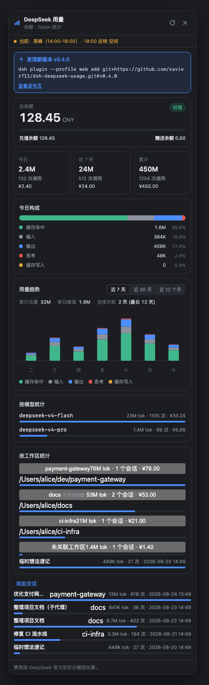
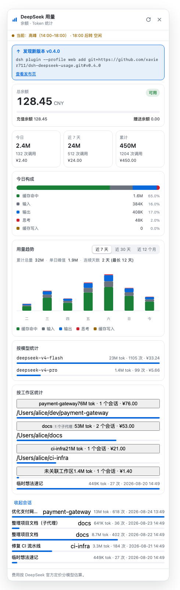

# dsh-deepseek-usage

[English](README.md)

DeepSeek 用量面板插件 —— 装在 [DeepSeek Harness](https://github.com/deepseek-ai/deepseek-harness) 的 Web 界面里，在左侧边栏底部显示你的用量：

- **账户余额**：实时查询官方接口 `GET /user/balance`（余额、充值/赠送拆分）
- **本地用量**：回放你本机会话日志里的官方 token 计数 —— 今日 / 近 7 天 / 累计、7 天柱状图、今日构成、按会话明细、**按模型统计**、**按工作区统计**（工作区 = 会话所在的项目目录，每个工作区可展开查看自己的会话记录；子代理会话计入其父工作区）
- **费用估算**：按模型套用 DeepSeek **官方定价**（含 2026-08-17 起 V4 系列峰谷定价，北京时间自动区分高峰/空闲；2026-08-23 起**周末（周六、周日）全天按低谷价计费**，不再区分峰谷）。侧边栏入口和面板头部会实时显示**当前时段标识**（高峰/空闲，含当前时段区间与下一次切换时间）

> 说明：DeepSeek 官方 API 没有账号级用量查询接口（实测所有候选路径均 404），所以用量数据来自 harness 本地会话日志 —— 日志里记录的就是官方每次请求返回的真实 usage。

## 界面预览

点击侧边栏底部的「用量」入口打开面板。下图数据均为**虚构示例**，不含任何真实余额、Key、token 或会话内容。

| 深色主题 | 浅色主题 |
|---|---|
|  |  |

## 安装（3 种方式，选一种）

需要先装好 **Node.js**（[nodejs.org](https://nodejs.org) 下载安装即可）。

### 方式 A：GitHub 直接安装（推荐，一条命令）

在终端粘贴运行：

```sh
dsh plugin --profile web add git+https://github.com/xavier711/dsh-deepseek-usage.git#v0.4.0
```

**没有全局安装过 `dsh`？** 用这条（npx 会自动下载）：

```sh
npx --yes @deepseek-ai/dsh plugin --profile web add git+https://github.com/xavier711/dsh-deepseek-usage.git#v0.4.0
```

> 提示：安装过程中如果提示 pnpm 不存在，先运行 `npm install -g pnpm` 再重试。

### 方式 B：下载文件夹 + 一键脚本

1. 下载或 clone 本仓库：

```sh
git clone https://github.com/xavier711/dsh-deepseek-usage.git
cd dsh-deepseek-usage
```

2. 运行安装脚本（脚本会自动处理 `dsh` 不存在的情况，改用 npx）：

```sh
./install.sh
```

### 方式 C：npm 安装

```sh
dsh plugin --profile web add @xavier711/dsh-deepseek-usage
```

---

### 安装后（无论哪种方式）

1. **重启 web 服务**：在运行 `dsh web` 的终端按 `Ctrl+C`，然后重新运行 `dsh web`（没有全局 dsh 就运行 `npx --yes @deepseek-ai/dsh web`）
2. **刷新浏览器页面**：左侧边栏底部、设置按钮上方会出现一个「用量」入口

> 因为插件声明了 `dsh.bundle`，安装命令会自动激活插件行，**不需要手动改任何配置文件**。

## 可选：配置 API Key（看余额用）

编辑 `~/.dsh/.credentials.yaml`，加入一行（把 `sk-xxxx` 换成你自己的 Key）：

```yaml
DEEPSEEK_API_KEY: sk-xxxx
```

或者设置环境变量 `DEEPSEEK_API_KEY`。不配置也能看本地用量统计，只是余额卡片会提示。

## 卸载

```sh
dsh plugin --profile web remove @xavier711/dsh-deepseek-usage
```

然后重启 `dsh web` 并刷新页面。

## 隐私说明

插件**不内置任何 API Key**（代码里没有任何密钥）。Key 只在运行时从你自己机器的 `~/.dsh/.credentials.yaml` 或环境变量读取，且只在服务器端使用——浏览器端永远接触不到 Key。放心分享。

## 项目结构

```
lib/index.js       宿主端：/dsh-usage/balance + /dsh-usage/local + /dsh-usage/period 路由
lib/client.js      浏览器端：侧边栏「用量」入口 + 面板（纯手写 bundle，无构建步骤）
cordis.patch.yml   插件自身的 patch 层（dsh.bundle 声明，安装即自动激活）
install.sh         一键安装脚本
```

## 配置项（可选，一般不用动）

在 `~/.dsh/profiles/web/cordis.patch.yml` 里按行 id 覆盖：

```yaml
- id: deepseek-usage
  config:
    balanceTtlMs: 60000      # 余额缓存毫秒数
    maxSessions: 100         # 统计最近多少个会话
    sessionConcurrency: 4    # 并行读取会话数
    balanceTimeoutMs: 10000  # 余额请求超时
    localTtlMs: 30000        # 本地统计缓存毫秒数（信号驱动刷新下保持廉价）
    newPricingAt: 1786896000000   # 峰谷定价生效时间（2026-08-17 00:00 北京时间）
    weekendOffPeakAt: 1787414400000  # 周末全天低谷价生效时间（2026-08-23 00:00 北京时间）
    peakHours: [[9,12],[14,18]]   # 北京时间高峰时段
    # pricing: 按模型单价（元/百万 tokens），详见源码仓库
```

## 更新

**npm 安装的用户**：执行 `dsh plugin --profile web update @xavier711/dsh-deepseek-usage`（或按新版本号重新 add，如 `... add @xavier711/dsh-deepseek-usage@X.Y.Z`）。

**Git 安装的用户**：你安装的是固定 tag 的快照，**不会自动更新**——但你也不用自己去查：插件每次打开用量面板时（带小时级缓存）会查询 GitHub 最新发布，如果有新版本，面板顶部会显示**「发现新版本」**提示条和完整的更新命令。照命令执行、重启 `dsh web`、刷新页面即可：

```sh
dsh plugin --profile web remove @xavier711/dsh-deepseek-usage
dsh plugin --profile web add git+https://github.com/xavier711/dsh-deepseek-usage.git#v0.4.0
```

## 常见问题

**安装时提示 `dsh: warning: ... declares no dsh.bundle — installed as a plain dependency`**

装到了仓库的旧快照（pnpm 按提交缓存 git 依赖，在插件声明 `dsh.bundle` 之前安装过就会保留旧版本）。重新从固定 tag 安装即可：

```sh
dsh plugin --profile web remove @xavier711/dsh-deepseek-usage
dsh plugin --profile web add git+https://github.com/xavier711/dsh-deepseek-usage.git#v0.4.0
```

然后重启 `dsh web` 并刷新页面。

**安装后没有看到「用量」入口**

确认安装后重启了 web 服务（在 `dsh web` 的终端按 Ctrl+C 再重新运行），并强制刷新浏览器（Cmd/Ctrl+Shift+R）。

## HTTP 路由

- `GET /dsh-usage/balance` — `{ ok, isAvailable, currency, totalBalance, grantedBalance, toppedUpBalance, ... }`
- `GET /dsh-usage/local` — `{ ok, sessionCount, errorSessions, pricing, buckets: { today, week, total }, days: [...7], models: [...], workspaces: [...], sessions: [...] }`——每个工作区条目为 `{ path, name, sessionCount, subagentSessionCount, buckets: { today, week, total }, sessions: [...] }`（无工作目录的会话归入 `path: null`）；每个会话行带 `workspace` 与 `subagent` 字段（pricing 含 `newPricingAt`、`weekendOffPeakAt`、`peakHours`）
- `GET /dsh-usage/period` — `{ ok, now, period: 'peak'|'offPeak'|'flat', range: [start, end] 分钟数, nextAt, nextPeriod, peakHours, weekendOffPeakAt, timezoneOffsetMinutes }` — 当前北京时间高峰/空闲分类，供侧边栏徽标与面板头部使用；`nextAt`/`nextPeriod` 描述下一次真正的时段切换（周末会直接跳到下一个工作日的首个高峰开始时刻）
